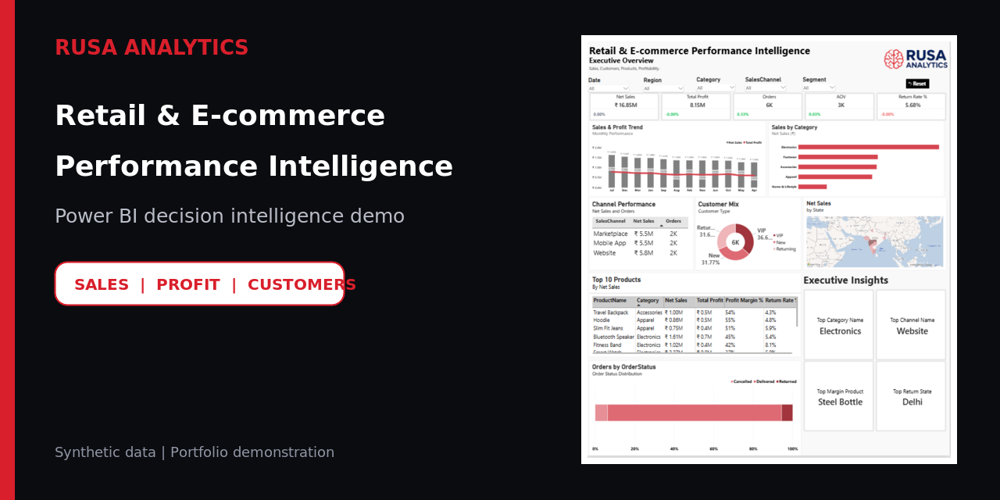
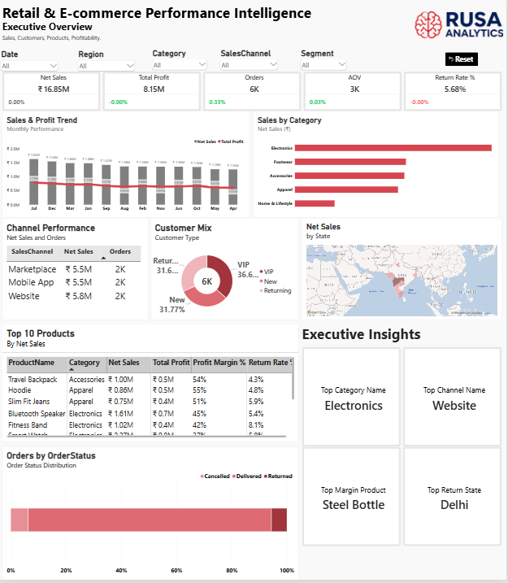
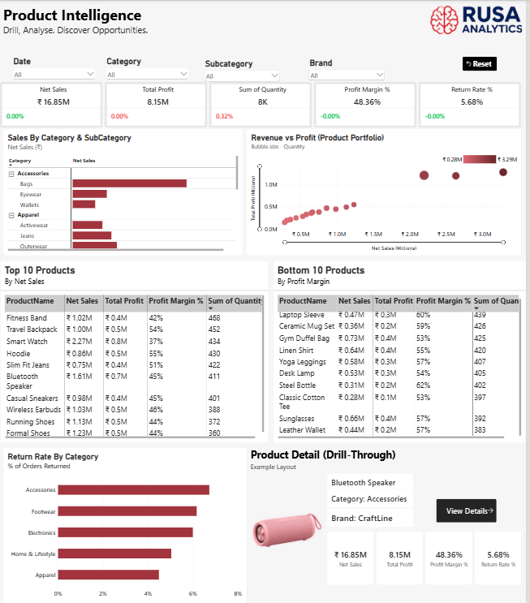
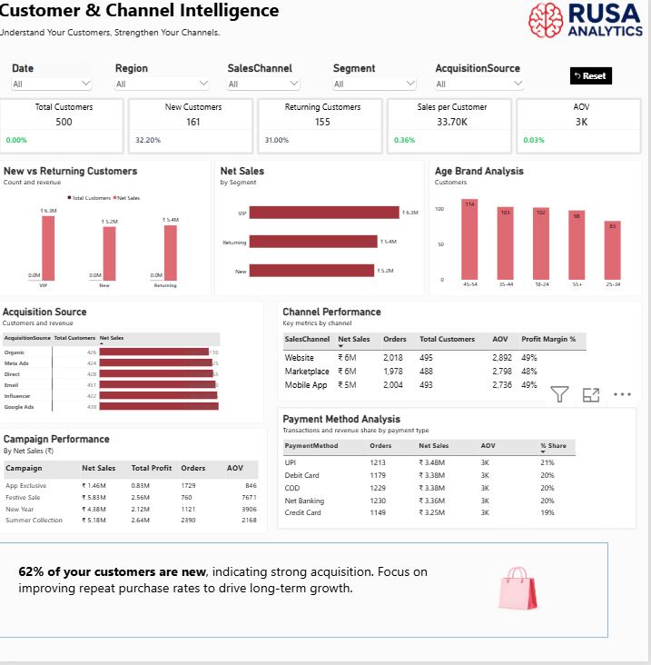
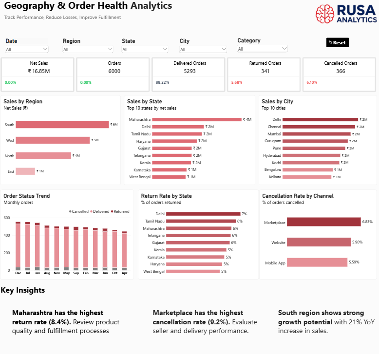

# Retail & E-commerce Performance Intelligence



A four-page Power BI demonstration project created by **RUSA Analytics** to show how retail and e-commerce data can be converted into decision-ready views for leadership, product, customer, geography, and order-health analysis.

> **Demo disclosure:** This portfolio project uses synthetic data. It is not a live client implementation, and the figures shown should not be interpreted as verified business results.

## Dashboard scope

The report is organized into four decision views:

1. **Executive Summary** — net sales, profit, orders, return rate, regional performance, category contribution, and monthly trends.
2. **Product & E-commerce Analytics** — product/category performance, channel and device mix, discount impact, and product-level comparisons.
3. **Customer Insights** — customer segmentation, repeat behaviour, acquisition mix, and customer-value analysis.
4. **Geography & Order Health** — geographic performance, payment behaviour, order status, delivery health, and return monitoring.

## Headline demo metrics

| Metric | Value shown in dashboard |
|---|---:|
| Net sales | ₹16.85M |
| Total profit | ₹8.15M |
| Orders | 6,000 |
| Return rate | 5.68% |

These are synthetic demonstration figures taken from the dashboard's overall view.

## Screenshots

### Executive Summary



### Product & E-commerce Analytics



### Customer Insights



### Geography & Order Health



## Repository contents

```text
.
├── README.md
├── REPOSITORY_DETAILS.md
├── .gitignore
├── assets/
│   ├── github-social-preview.png
│   ├── executive-summary.png
│   ├── product-ecommerce-analytics.png
│   ├── customer-insights.png
│   └── geography-order-health.png
└── docs/
    ├── CASE_STUDY.md
    └── SETUP.md
```

The Power BI source file, semantic model, DAX logic, and detailed source data are proprietary and will not be distributed publicly. The public demonstration uses this documentation, screenshots, video, and a static HTML showcase.

## Tools demonstrated

- Microsoft Power BI Desktop
- Power Query
- DAX measures
- Dimensional data modelling
- Interactive filtering and drill-through design

## Current status

This repository package is suitable for private portfolio review. Complete the QA items documented in [`docs/SETUP.md`](docs/SETUP.md) before publishing the HTML showcase or promoting the project publicly.

## Public demo policy

- Publish the HTML showcase, screenshots, documentation, and approved demo video.
- Keep the `.pbix` file, dataset, semantic model, Power Query steps, and detailed DAX measures private.
- Do not expose downloadable source files through GitHub Releases or public cloud links.

## About RUSA Analytics

RUSA Analytics builds AI-powered decision intelligence solutions across data foundations, analytics, automation, AI engineering, and generative AI.

- Website: [rusaanalytics.com](https://rusaanalytics.com)
- Business enquiries: Use the contact form on the website.
